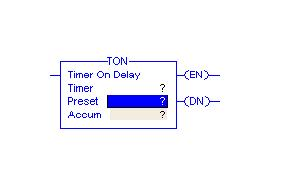
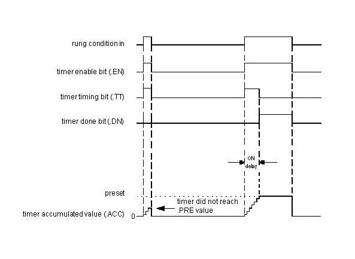
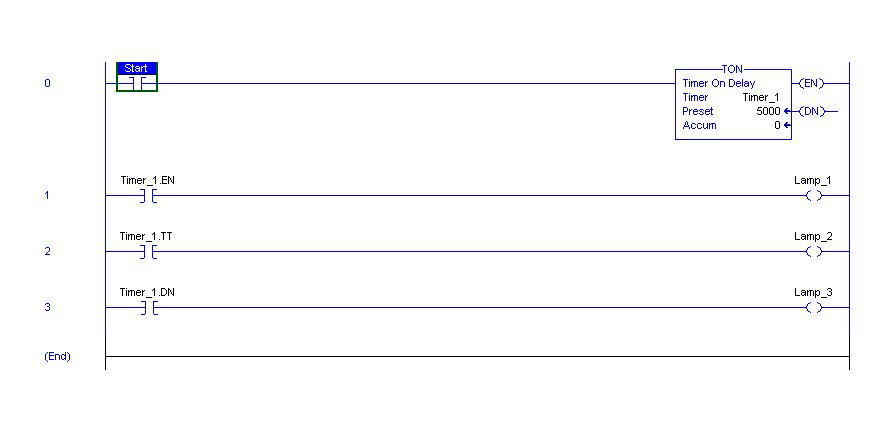

PLC timers instruction is used to activate or deactivate a device after a preset interval of time.

### Types of Timers available are: 
1. On-Delay timer (TON)
2. Off-Delay timer (TOF)
3. Retentive timer on (RTO)

### On-Delay Timer (TON)
It is used when an action is to begin a specified time after the input becomes true.
Consider an example wherein a certain step in the manufacturing process is to begin 30 seconds after a signal is received from a limit switch. The 30 seconds delay is the ON-delay timer’s preset value.
The figure below shows a symbolic representation of the timer.

The instruction mainly includes three status bits namely EN, TT, DN. Their significance is as follows:

**Enable (EN) Bit:**  - The enable bit indicates the TON instruction is enabled
**Timer-Timing (TT) Bit:** - The timing bit indicates that a timing operation is in process.
**Done (DN) Bit:** - The done bit changes state whenever the accumulated value reaches the preset value.
**Accumulator (ACC) Bit:** - The accumulated value specifies the number of milliseconds that have elapsed since the TON instruction was enabled.
**Preset (PRE) Bit:** - The preset value specifies the value (1msec units) which the accumulated value must reach before the instruction sets the .DN bit.

The figure shows the timing diagram which illustrates the functioning of all the bits in sequence.

The following example, after running, will illustrate the function of each bit.

Before toggling the Start, all the lamps namely Lamp_1, Lamp_2 and Lamp_3 are OFF.

**After the Start is toggled, Lamp_1 and Lamp_2 are ON. This implies the Timer_1 is enabled and its timer timing bit is activated. After the delay i.e. preset value of the timer, Lamp_1 and Lamp_3 are ON and Lamp_2 will be OFF.**

The Function Block Diagram, Timing diagrams, and ladder diagram solutions are as per the available PLC(Rockwell Automation) in College of Engineering Pune.

It will be better understood after the given example is developed on the simulator.
