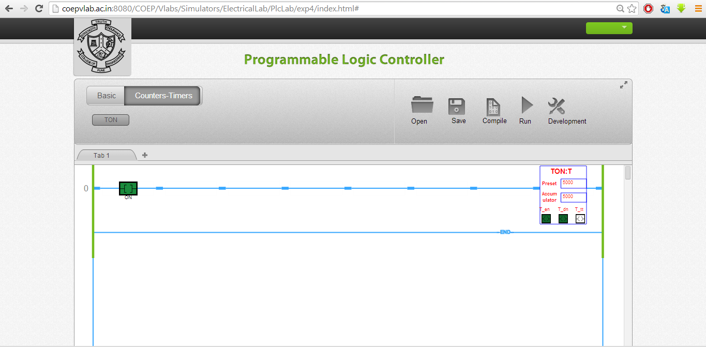
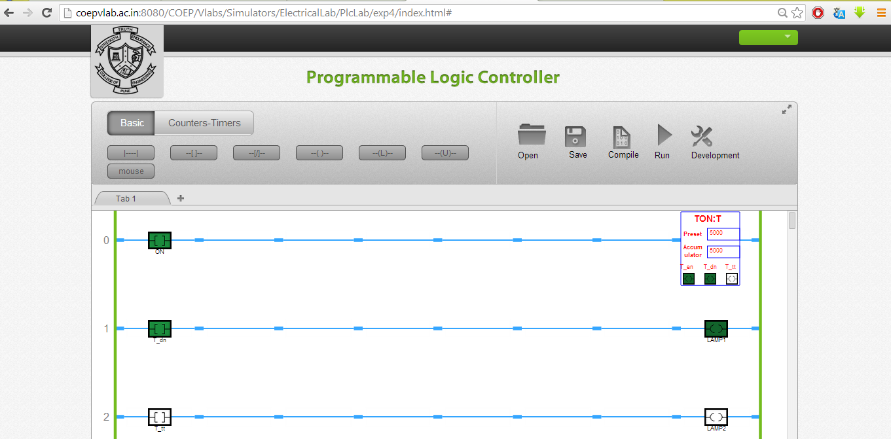

### Develop an application using On-Delay Timer
* In this experiment the on delay timer will be tested for its functionalities using Simulator. Following bits of the
* timer are to be observed.
* Initialising bit "ON" in this case.
* Enable bit "T_en"
* Done bit "T_dn"
* Timer timing bit "T_tt"
* Preset value needs to be entered by the user.
* While configuring the timer thedefault time is 1 mS. Select appropriate preset value as per the need of the application. The screen shot of the configured timer will appear like this.
* To test the EN, DN, and TT bits;configure the timer by right clicking anywhere on the timer block. Submit tag and preset value.

* Add new rung to test the timer status or to energies the output. You can also test the cascading of the timer using these bits.
* Observe the tag name for timer DN bit. See following screen shot to observe the output bit status when delay is over.

* Observe the bit status in Run mode when input a is toggled again.